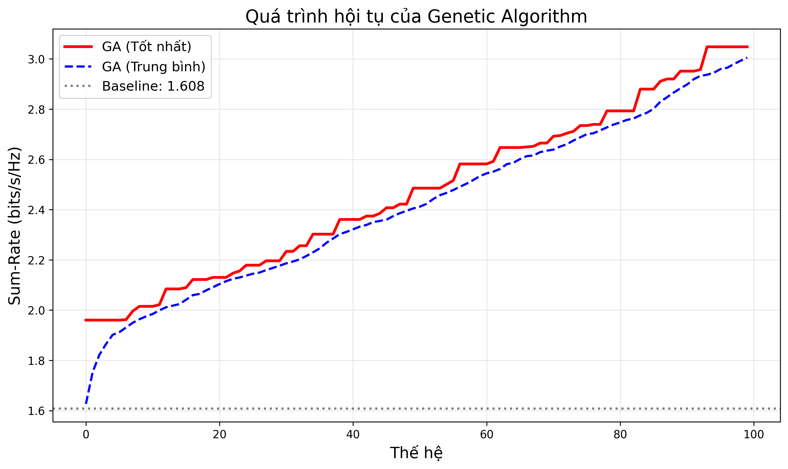
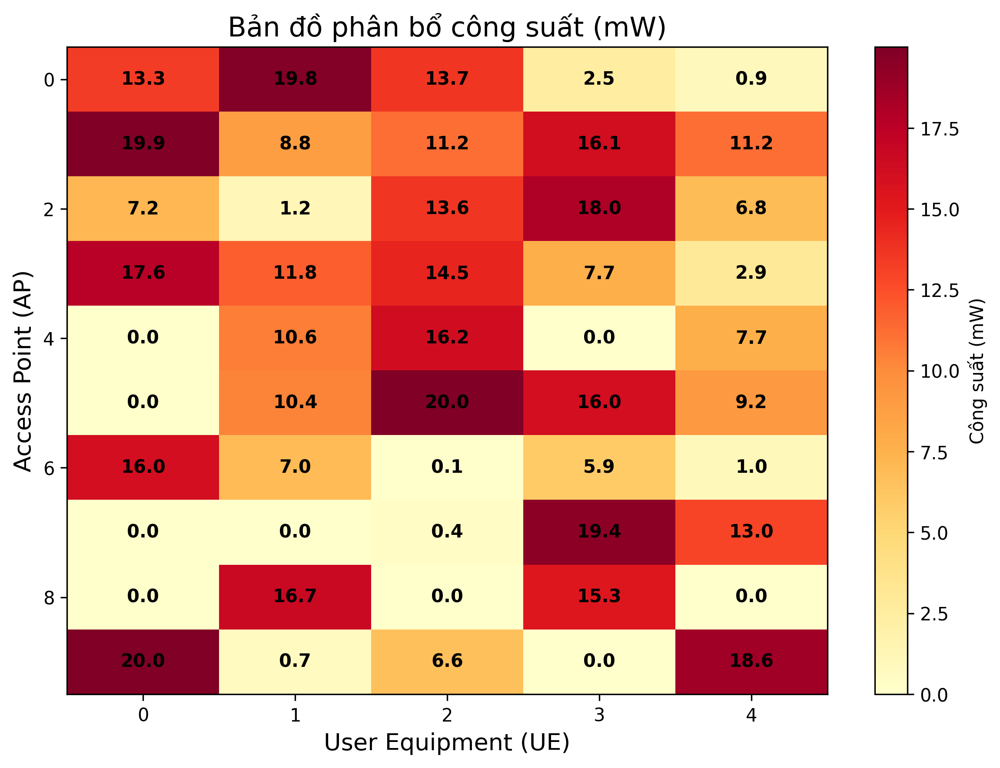
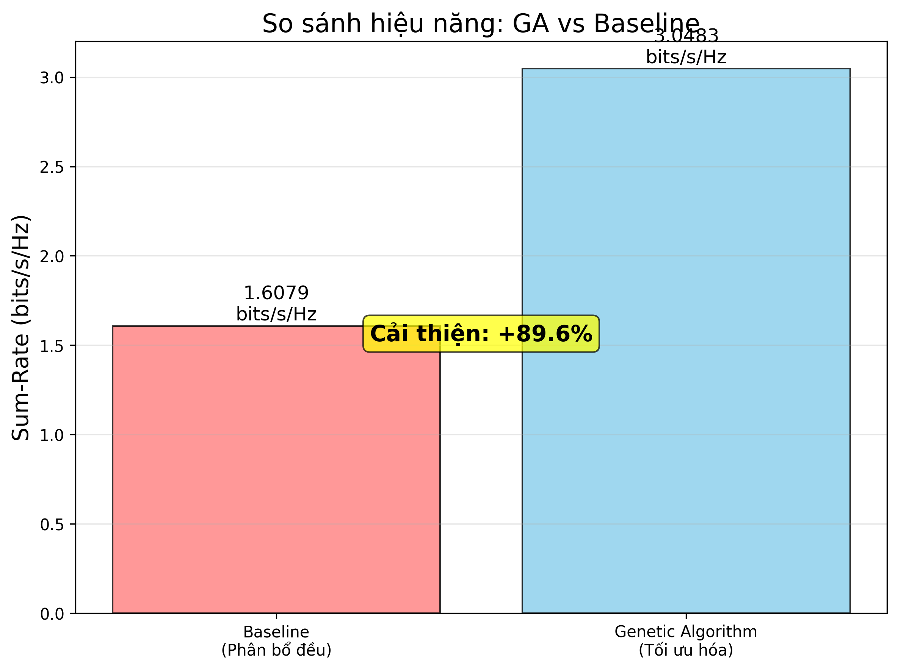
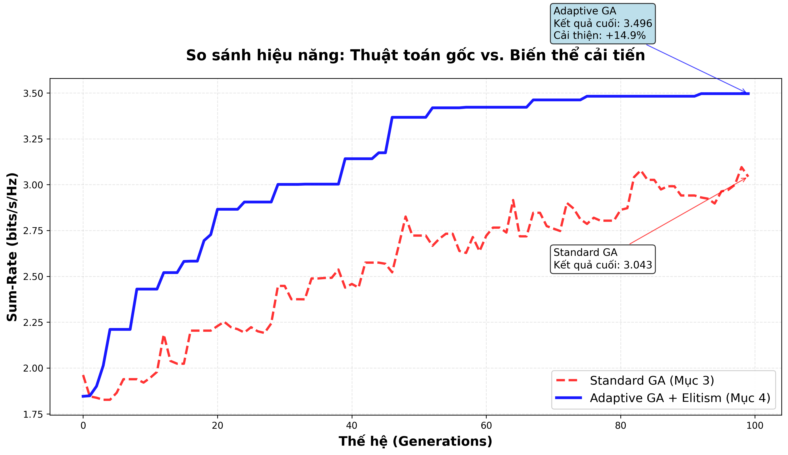

# Genetic Algorithm for Power Allocation in Cell-Free Massive MIMO

[](https://www.python.org/downloads/)
[](https://numpy.org/)
[](https://matplotlib.org/)
[](LICENSE)

## 📋 Mô tả đề tài

Đề tài nghiên cứu ứng dụng **Genetic Algorithm (GA)** để giải quyết bài toán **phân bổ công suất tối ưu** trong hệ thống **Cell-Free Massive MIMO**.

**Mục tiêu**: Tối đa hóa Sum-Rate (tổng tốc độ truyền) của hệ thống với ràng buộc công suất tối đa mỗi Access Point.

**Sinh viên thực hiện**:
- Hoàng Mạnh Kiên - 20215068
- Trần Trung Đức - 20210210

**Giảng viên hướng dẫn**: TS. Trịnh Văn Chiến

---

## 🎯 Bài toán

### Thông số hệ thống:
- **M = 10**: Số Access Points (APs)
- **K = 5**: Số User Equipments (UEs)
- **P_max = 100 mW**: Công suất tối đa mỗi AP
- **σ² = 1 mW**: Công suất nhiễu
- **Vùng phủ sóng**: 1000m × 1000m

### Hàm mục tiêu:
Maximize: **Sum-Rate** = Σ<sub>k=1</sub><sup>K</sup> log₂(1 + SINR<sub>k</sub>)

### Ràng buộc:
Σ<sub>k=1</sub><sup>K</sup> p<sub>mk</sub> ≤ P<sub>max</sub>, ∀m ∈ {1,...,M}

---

## 📁 Cấu trúc thư mục

```
.
├── src/                              # Source code
│   ├── ga_power_allocation.py        # Code chính - GA đầy đủ
│   ├── ga_power_allocation_simple.py # Phiên bản đơn giản
│   └── ga_variant_comparison.py      # So sánh biến thể GA
├── results/                          # Kết quả thực nghiệm
│   ├── convergence.png               # Biểu đồ hội tụ
│   ├── heatmap.png                   # Bản đồ phân bổ công suất
│   ├── comparison.png                # So sánh GA vs Baseline
│   └── variant_comparison.png        # So sánh Standard vs Adaptive GA
├── docs/                             # Tài liệu
│   ├── HUONG_DAN_TRINH_BAY.md       # Hướng dẫn trình bày
│   └── report_latex.tex              # Báo cáo LaTeX
├── .gitignore                        # Git ignore file
├── requirements.txt                  # Dependencies
├── LICENSE                           # Giấy phép MIT
└── README.md                         # File này
```

---

## 🚀 Cài đặt và Sử dụng

### 1. Clone repository

```bash
git clone https://github.com/Kiengabby/ga-cellfree-mimo-power-allocation.git
cd ga-cellfree-mimo-power-allocation
```

### 2. Tạo môi trường ảo (khuyến nghị)

```bash
python3 -m venv .venv
source .venv/bin/activate  # Linux/macOS
# hoặc
.venv\Scripts\activate     # Windows
```

### 3. Cài đặt thư viện

```bash
pip install -r requirements.txt
```

### 4. Chạy chương trình

#### Chạy GA chính (tạo 3 biểu đồ):
```bash
python src/ga_power_allocation.py
```

#### Chạy phiên bản đơn giản:
```bash
python src/ga_power_allocation_simple.py
```

#### So sánh biến thể GA:
```bash
python src/ga_variant_comparison.py
```

---

## 🧬 Cấu hình Genetic Algorithm

| Tham số | Giá trị | Mô tả |
|---------|---------|-------|
| **Kích thước quần thể** | 50 | Số lượng cá thể mỗi thế hệ |
| **Số thế hệ** | 100 | Số vòng lặp tiến hóa |
| **Xác suất lai ghép (p<sub>c</sub>)** | 0.8 | Tỷ lệ lai ghép cha mẹ |
| **Xác suất đột biến (p<sub>m</sub>)** | 0.2 | Tỷ lệ đột biến gene |
| **Chọn lọc** | Tournament (k=3) | Phương pháp chọn lọc |
| **Lai ghép** | Arithmetic Crossover | Phương pháp lai ghép |
| **Đột biến** | Gaussian Mutation | Phương pháp đột biến |
| **Elitism** | 10% | Giữ lại cá thể tốt nhất |

---

## 📊 Kết quả

### Hiệu năng:
- **Baseline (Phân bổ đều)**: ~1.61 bits/s/Hz
- **Genetic Algorithm**: ~3.05 bits/s/Hz
- **Mức cải thiện**: **+89.5%**

### So sánh biến thể:
- **Standard GA**: ~3.04 bits/s/Hz
- **Adaptive GA**: ~3.50 bits/s/Hz
- **Mức cải thiện**: **+14.9%**

### Biểu đồ kết quả:

<div align="center">
  
  
</div>

<div align="center">
  
  
</div>

---

## 🔬 Chi tiết thuật toán

### Standard GA:
1. **Khởi tạo** quần thể ngẫu nhiên (Real-coded)
2. **Đánh giá** fitness (Sum-Rate)
3. **Chọn lọc** Tournament Selection (k=3)
4. **Lai ghép** Arithmetic Crossover
5. **Đột biến** Gaussian Mutation
6. **Sửa lỗi** Repair Mechanism (đảm bảo ràng buộc)
7. **Thay thế** thế hệ với Elitism

### Adaptive GA (Cải tiến):
- ✅ **Đột biến thích ứng**: p<sub>m</sub> giảm từ 0.5 → 0.01
- ✅ **Elitism**: Giữ nguyên cá thể tốt nhất
- ✅ **Tournament k=3**: Áp lực chọn lọc cao hơn
- ✅ **Fine-tuning**: Nhiễu đột biến giảm dần

---

## 📚 Tài liệu tham khảo

[1] H. Q. Ngo, A. Ashikhmin, H. Yang, E. G. Larsson, and T. L. Marzetta, "Cell-Free Massive MIMO Versus Small Cells," *IEEE Transactions on Wireless Communications*, vol. 16, no. 3, pp. 1834-1850, 2017.

[2] D. E. Goldberg, *Genetic Algorithms in Search, Optimization, and Machine Learning*. Addison-Wesley, 1989.

[3] D. Whitley, "A Genetic Algorithm Tutorial," *Statistics and Computing*, vol. 4, pp. 65-85, 1994.

[4] E. Björnson, L. Sanguinetti, "Making Cell-Free Massive MIMO Competitive With MMSE Processing and Centralized Implementation," *IEEE Transactions on Wireless Communications*, vol. 19, no. 1, pp. 77-90, 2020.

---

## 📝 License

Dự án này được phân phối dưới giấy phép [MIT License](LICENSE).

---

## 👥 Liên hệ

- **Hoàng Mạnh Kiên**: kien.hm215068@sis.hust.edu.vn
- **Trần Trung Đức**: duc.tt210210@sis.hust.edu.vn

---

## 🙏 Lời cảm ơn

Em xin chân thành cảm ơn **TS. Trịnh Văn Chiến** đã hướng dẫn và hỗ trợ trong quá trình thực hiện đề tài này.

---

<div align="center">
  <strong>Trường Đại học Bách Khoa Hà Nội</strong><br>
  <em>Hanoi University of Science and Technology</em><br>
  2024-2025
</div>
